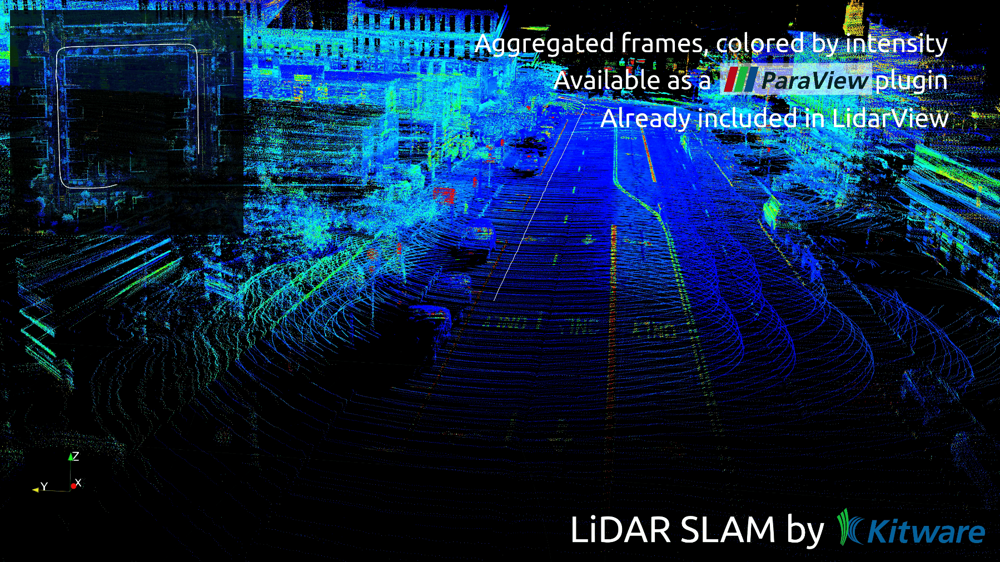
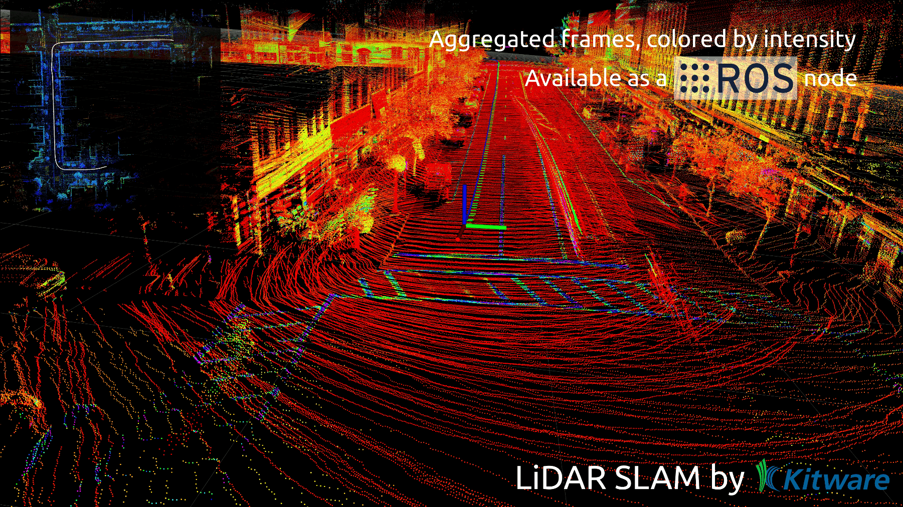

This is a fork from [Kitware](https://gitlab.kitware.com/keu-computervision/slam/-/tree/856af04ca3fd758b8f6fb2fc168d17aa63a3481d)





# LiDAR SLAM

- [LiDAR SLAM](#lidar-slam)
  - [Introduction and contents](#introduction-and-contents)
  - [Core SLAM lib](#core-slam-lib)
    - [Dependencies](#dependencies)
    - [Installation](#installation)
      - [With system dependencies](#with-system-dependencies)
      - [With local dependencies](#with-local-dependencies)
      - [With Superbuild](#with-superbuild)
  - [ROS wrapping](#ros-wrapping)
    - [Dependencies](#dependencies-1)
    - [Installation](#installation-1)
      - [With system dependencies](#with-system-dependencies-1)
      - [With local dependencies](#with-local-dependencies-1)
      - [With Superbuild](#with-superbuild-1)
    - [Live usage](#live-usage)
  - [ROS2 wrapping on Linux](#ros2-wrapping-on-linux)
    - [Dependencies](#dependencies-2)
    - [Installation](#installation-2)
      - [With system dependencies](#with-system-dependencies-2)
      - [With local dependencies](#with-local-dependencies-2)
      - [With Superbuild](#with-superbuild-2)
    - [Live usage](#live-usage-1)
  - [ROS2 wrapping on Windows 10](#ros2-wrapping-on-windows-10)
    - [Install dependencies](#install-dependencies)
      - [Install ROS2 and slam dependencies](#install-ros2-and-slam-dependencies)
      - [Install pcl-conversions](#install-pcl-conversions)
    - [Install SLAM package](#install-slam-package)
  - [ParaView wrapping](#paraview-wrapping)
    - [Dependencies](#dependencies-3)
    - [Installation](#installation-3)
    - [Usage](#usage)
    - [Use SLAM in LidarView](#use-slam-in-lidarview)

## Introduction and contents

This repo contains LiDAR-only visual SLAM developped by Kitware, as well as ROS and ParaView wrappings for easier use.

It has been successfully tested on data from several common LiDAR sensors:
- Velodyne (VLP-16, VLP-32c, HDL-32, HDL-64, VLS-128)
- Ouster (OS0/1/2-32/64/128)
- RoboSense (RS-LiDAR-16 RS-LiDAR-32)
- Hesai (PandarXT16, PandarXT32, Pandar128)

Have a look at our [SLAM demo video](https://vimeo.com/524848891)!

This codebase is under active development. If you're interested by new features, new sensors' support or any project that could be using this SLAM, do not hesitate to contact us at kitware@kitware.com.

Repo contents :
- `slam_lib/` : core *LidarSlam* library containing SLAM algorithm and other utilities.
- `superbuild/` : Cross-platform installer.
- `ros_wrapping/` : ROS packages to enable SLAM use on a ROS system.
- `ros2_wrapping/`: ROS2 packages to enable SLAM use on a ROS2 system.
- `paraview_wrapping/` : ParaView plugin to enable SLAM use with ParaView/LidarView.
- `ci/` : continuous integration files to automatically build and check *LidarSlam* lib.
- `CMakeLists.txt` : *CMakeLists* used to call to build core *LidarSlam* lib and *paraview_wrapping*.

## Core SLAM lib

### Dependencies

Dependencies are listed in the table below along with the version used during development and testing. Minimum required versions have not been determined yet.

| Dependency | Minimum tested Version |
| :--------: | :--------------------: |
| Eigen3     | 3.3.4                  |
| Ceres      | 1.13.0                 |
| PCL        | 1.8                    |
| nanoflann  | 1.3.0                  |
| g2o*       | 1.0.0 (master)         |
| OpenMP*    | 2.0                    |
| gtsam*     | 4.2a8                  |
| OpenCV*    | 4.5.4                  |

(*) optional dependencies :

- If G2O is not available (or disabled), *LidarSlam* lib will still be compiled, but without pose graph optimization features.
- If GTSAM is not available (or disabled), *LidarSlam* lib will still be compiled, but without IMU processing features.
- If OpenCV is not available (or disabled), *LidarSlam* lib will still be compiled, but without camera features.
- If OpenMP is available, it is possible to use multi-threading to run some SLAM steps in parallel and achieve higher processing speed.
- If OpenCV is not available (or disabled), *LidarSlam* lib will still be compiled, but without camera integration.

**/!\ Warning** Make sure to compile/install G2O with the same Ceres version as the one used in the SLAM compilation. To do so, disable the feature [G2O_USE_VENDORED_CERES](https://github.com/RainerKuemmerle/g2o/blob/master/CMakeLists.txt) during G2O compilation and link against the right version of Ceres.

### Installation

The *LidarSlam* lib has been tested on Linux, Windows and OS X.

First, got to your workspace directory and clone the SLAM repository.
```bash
git clone https://gitlab.kitware.com/keu-computervision/slam.git src --recursive
```

#### With system dependencies

To build only *LidarSlam* lib using your system dependencies, run :

```bash
cmake -E make_directory build && cd build
cmake ../src -DCMAKE_BUILD_TYPE=Release
cmake --build . -j
```

**NOTE** : On Windows, if some dependencies were installed using vcpkg, the variable `CMAKE_TOOLCHAIN_FILE` must be specified :
cmake ../src -DCMAKE_BUILD_TYPE=Release -DCMAKE_TOOLCHAIN_FILE=[vcpkg-install]/scripts/buildsystems/vcpkg.cmake

#### With local dependencies

You can link to the local libraries you have installed adding cmake flags. Notably with Ceres and G2O:
```bash
cmake ../src -DCMAKE_BUILD_TYPE=Release -DCeres_DIR=path/to/CeresConfig.cmake -Dg2o_DIR=path/to/g2oConfig.cmake
```

## ROS2 wrapping on Linux

You can download the ROS2 package in [the artifacts of the CI pipeline](https://gitlab.kitware.com/keu-computervision/slam/-/pipelines) for any version.

A docker image is available on [this link](https://send.kitware.io/download.php?id=2329&token=yyoAxvfKEYECXOhxedzjkFMSVzkhKI66). It can also be found in [the artifacts of the feat/ROS2 branch](https://gitlab.kitware.com/keu-computervision/slam/-/pipelines?page=1&scope=all&source=web&ref=feat%2FROS2) if it has been triggered manually.
You can load and run this image with :

```
docker load -i slam_image.tar
docker run -it --rm slam:<CURRENT_COMMIT> bash
```

replacing CURRENT_COMMIT with the image commit sha.

### Dependencies

Ensure all *LidarSlam* dependencies are respected (see next sections to do so). Specific ROS packages dependencies are listed in the table below along with the version used during development and testing.

| Dependency      | Tested Versions | Install (`sudo apt-get install <pkg>`)                                             | status    |
|:---------------:|:---------------:|:----------------------------------------------------------------------------------:|:---------:|
| ROS             | humble/iron     | `ros-$ROS_DISTRO-desktop-full`                                                     | mandatory |
| pcl-ros         | 1.7.4           | `ros-$ROS_DISTRO-pcl-ros`                                                          | mandatory |
| gps_common      | 0.3.0           | `ros-$ROS_DISTRO-gps-common`                                                       | optional  |
| apriltag        | 3.2.0           | `ros-$ROS_DISTRO-apriltag`                                                         | optional  |
| g2o             | 5.3             | `ros-$ROS_DISTRO-libg2o`                                                           | optional  |


For Velodyne usage, please note that the ROS Velodyne driver with minimum version 1.6 is needed.
Be careful, this ROS Velodyne driver 1.6 is not backward-compatible with previous versions.
You can install the new Velodyne driver using the command `sudo apt install ros-$ROS_DISTRO-velodyne`.

For Ouster usage, the driver can be found in this [git repo](https://github.com/ouster-lidar/ouster-ros/tree/ros2). We recommand to build it on another workspace but you can also clone it under the ros2_wrapping folder and build it at the same time as the SLAM.

### Installation

Clone this git repo directly into your colcon workspace (called **colcon_ws** in the following), under the src directory

 ```bash
 cmake -E make_directory colcon_ws && cd colcon_ws
 git clone https://gitlab.kitware.com/keu-computervision/slam.git src/slam --recursive -b feat/ROS2
```

The next sections describe how to install the dependencies (mandatory and/or optional) and to build the SLAM packages with the needed features.
The first step is to install pcl-ros before performing any of the next sections. Example with apt : `sudo apt-get install -y ros-$ROS_VERSION-pcl-ros`

**NOTE** : Boost, g2o, Eigen, Ceres and PCL should be already resolved at this point with previous installations.

#### With system dependencies

This applies if you have installed all the dependencies on your system, e.g. when you download binaries (with apt or other).

**NOTE** : The only mandatory missing dependency should be nanoflann at this point. Example to install it with apt : `sudo apt-get install -y libnanoflann-dev`.

Run `colcon build --base-paths src/slam/ros2_wrapping` or `colcon build --base-paths src/slam/ros2_wrapping --cmake-args -DCMAKE_BUILD_TYPE=Release` (to turn on optimizations, highly recommended when using Eigen). the variable base_paths must point to the path of the ros2_wrapping folder.
By default, this will build *LidarSlam* lib before ROS2 packages. If you want to use your system LidarSlam, you need to set the cmake variable BUILD_SLAM_LIB to OFF :
`colcon build --base-paths src/slam/ros2_wrapping --cmake-args -DCMAKE_BUILD_TYPE=Release -DBUILD_SLAM_LIB=OFF`

#### With local dependencies

This applies if you have built and installed some of the dependencies locally on your disk.
You can use local dependencies for Slam lib by passing their path to cmake.

_Example_ for Ceres and g2o :

 ```bash
 colcon build --base-paths src/slam/ros2_wrapping --cmake-args -DCMAKE_BUILD_TYPE=Release -DCeres_DIR=path/to/CeresConfig.cmake -Dg2o_DIR=path/to/g2oConfig.cmake
 ```

If you want to use a local version of LidarSlam library you can specify to the package not to build it and supply the path to the LidarSlam cmake file :

 ```bash
 colcon build --base-paths src/slam/ros2_wrapping --cmake-args -DCMAKE_BUILD_TYPE=Release -DBUILD_SLAM_LIB=OFF -DLidarSlam_DIR=path/to/LidarSlam.cmake
```

### Live usage

For Velodyne :
```bash
ros2 launch lidar_slam slam_velodyne.py use_sim_time:=false
ros2 lidar_slam slam_velodyne.py use_sim_time:=false gps:=true   # if GPS/SLAM calibration has to be run
```

For Ouster :
```bash
ros2 launch lidar_slam slam_ouster.py replay:=false
ros2 launch lidar_slam slam_ouster.py replay:=false gps:=true   # if GPS/SLAM calibration has to be run
```

See [ros2_wrapping/lidar_slam/README.md](ros2_wrapping/lidar_slam/README.md) for more details.

